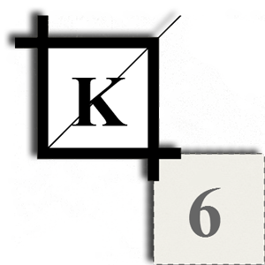

<!--  -->

<h3>Hi,</h3>
<h4>I am a senior Frontend developer working remotely from north Italy</h4>

<em>Current</em> stack: <code>typescript, react, next.js, radix-ui, zustand, tailwind</code>

<em>Future</em> hands on explorations: <code>sveltekit, astro, solidjs, deno/bun</code>

  see everything related to my job experience and my publicly available work on:  
  

  <small>you can write me at kunderikuus@gmail.com,</small>
    
  <small>cheers,</small>
    
  <em>kuus</em>

  
 

